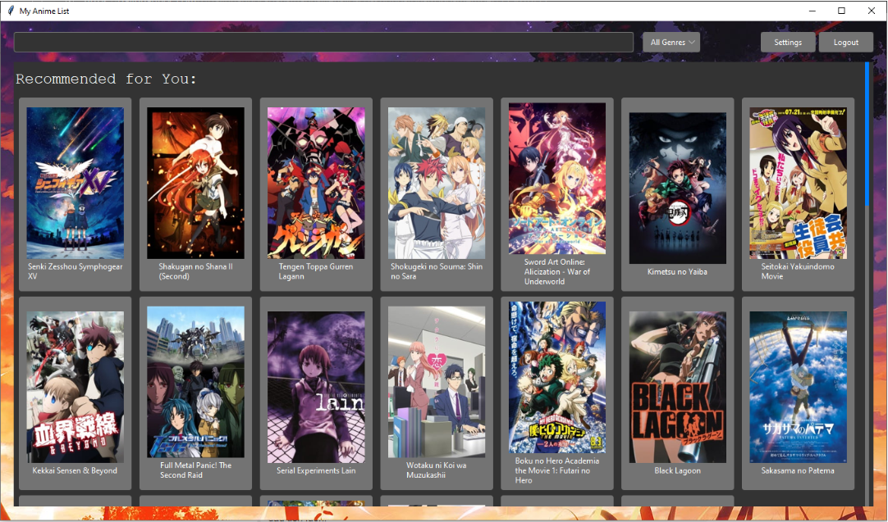
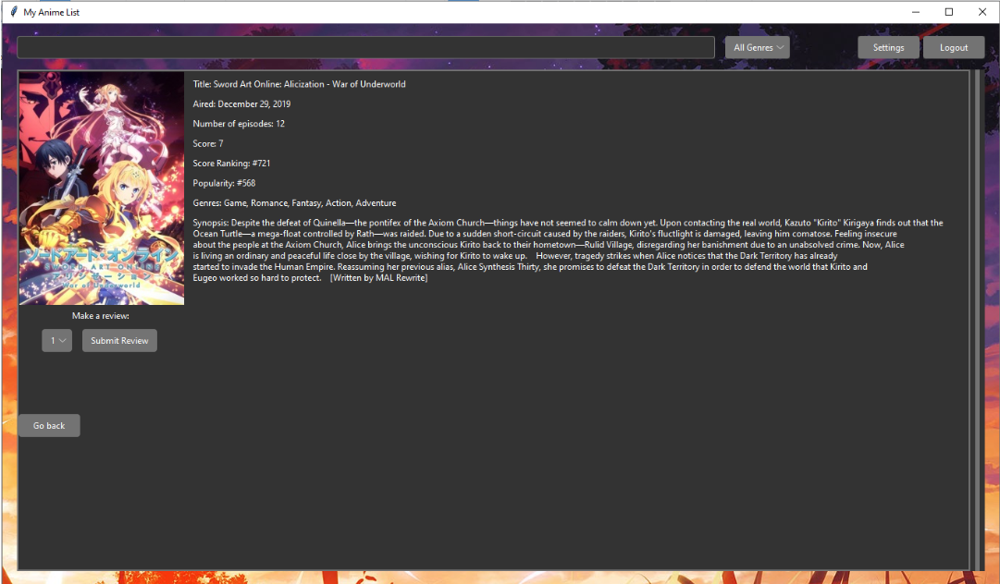

# Anime Recommendation System

<!-- TABLE OF CONTENTS -->

  
Table of Contents

  <ol>
    <li>
      <a href="#about-the-project">About The Project</a>
      <ul>
        <li><a href="#built-with">Built With</a></li>
        <li><a href="#data">Data</a></li>
      </ul>
    </li>
    <li><a href="#features">Features</a></li>
    <li><a href="#contributers">Contributers</a></li>
  </ol>

<!-- ABOUT THE PROJECT -->
## About The Project
This Anime Recomendation System attemps to use graph theory to provide personalized anime recomendations to users. Datasets containing information of animes, reviews and user profiles were processed to create an instance of AnimeGraph, which has verticies of three kinds; Anime, User and Genre. Genres were connected to Animes in that category and Users were connected to Animes they reviewed with the associated score as the edge weight. Recomendations were made in the following manner:
 - Newly registered users are shown the most most popular Animes as well as some new releases
 - A user with one or two reviews/favorites is shown Animes based on content-filtering, that is showing Animes in the same genres that the user has enjoyed
 - When a user reviews more than two Animes, we switch to a recomendations by similar users, which is calculated by measuring the proximity of the user in question with others, using different algorithms (Euclidean distance, Manhatten distance, Minkowski distance). 
 
 Additionally, the accuracy of the recomendation algorithms was measured by removing a third of the dataset in the computation and making recomendations for these users.  

For more information, references and analysis, see [Project Report.pdf](https://github.com/hashimr1/Data-Analysis-and-LinearRegressions/blob/main/Project%20Report.pdf) 

### Built With

* [Python](https://www.python.org/)
* [tkinter](https://docs.python.org/3/library/tkinter.html)
* [pandas](https://pandas.pydata.org/)
* [NumPy](https://numpy.org/)
* [Plotly](https://plotly.com/)
* [pillow](https://pillow.readthedocs.io/)

### Data
* [Animes](https://www.kaggle.com/datasets/marlesson/myanimelist-dataset-animes-profiles-reviews?select=animes.csv)
* [Profiles](https://www.kaggle.com/datasets/marlesson/myanimelist-dataset-animes-profiles-reviews?select=profiles.csv)
* [Reviews](https://www.kaggle.com/datasets/marlesson/myanimelist-dataset-animes-profiles-reviews?select=reviews.csv)

(<a href="#top">back to top</a>)

<!-- Features -->
## Features

- [ ] user registration and sign in
- [ ] colision detection
- [ ] detailed view of each anime
- [ ] providing anime recomendations based on watch history and reviews
- [ ] filtering anime based on tags and genres
- [ ] autocomplete search bar
- [ ] testing and evaluation of recomendation algorithms

(<a href="#top">back to top</a>)

<!-- CONTRIBUTERS -->
## Contributers
- Raazia Hashim
- Tu Pham
- Tahseen Rana
- Meet Patel

 [CSC111 - Foundations of Computer Science II](https://artsci.calendar.utoronto.ca/course/csc111h1)

(<a href="#top">back to top</a>)

